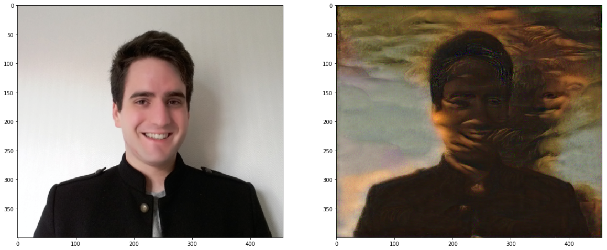

# style-transfer-pytorch
A Style Transfer agent that applies La Joconde's style to any picture.

 
This project is based on the Udacity's implementation.

## How to use it
- Clone/Fork the project
- Run Jupyter Notebook
- You can change style image and/or content image by upload your own files into `./images` folder
- Modify the name of the images in cell n°6.
- Enjoy

## How to modify the intensity of the style
- The application of the style can be modified by tuning the ratio between alpha and beta. The **smaller the ratio, the more stylistic effect you’ll see.**
